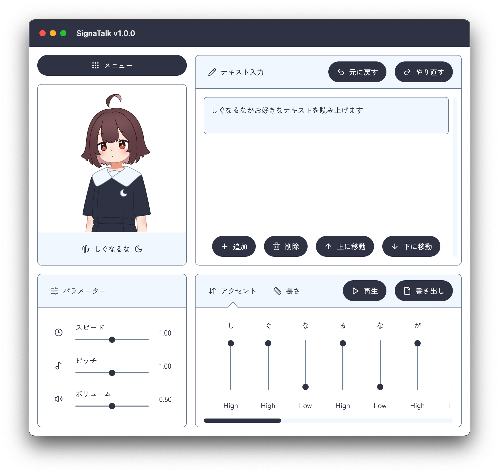

# SignaTalk



SignaTalkは無料で使える低品質なテキスト読み上げソフトです。  
このリポジトリではSignaTalkや立ち絵の配布を行います。  
IssueにSignaTalkの問題を報告していただいても構いません。  

## SignaTalkの使い方
~~こちらの解説動画をご覧ください。~~  
準備中

## ダウンロード

SignaTalk本体はこちら↓  
https://github.com/KoharuYuzuki/signatalk-release/releases

立ち絵はこちら↓  
[https://github.com/KoharuYuzuki/signatalk-release/tree/main/立ち絵](https://github.com/KoharuYuzuki/signatalk-release/tree/main/%E7%AB%8B%E3%81%A1%E7%B5%B5)

## ユーザー辞書について
ユーザー辞書はuser-dict.jsonに以下の形式で保存してください。  
ユーザー辞書を変更したら、メニューからリロードを行ってください。  

```
{
  "雲母坂": [
    { "kana": "き", "accent": "low" },
    { "kana": "ら", "accent": "high" },
    { "kana": "ら", "accent": "high" },
    { "kana": "ざ", "accent": "low" },
    { "kana": "か", "accent": "low" }
  ]
}
```

kanaに使用できる文字は以下の通りです。  

```
、
あ い う え お
ぁ ぃ ぅ ぇ ぉ
か き く け こ
さ し す せ そ
た ち つ て と
な に ぬ ね の
は ひ ふ へ ほ
ま み む め も
や ゆ よ
ら り る れ ろ
わ を ん
ゖ っ ゃ ゅ ょ ゎ
が ぎ ぐ げ ご
ざ じ ず ぜ ぞ
だ ぢ づ で ど
ば び ぶ べ ぼ
ゔ
ぱ ぴ ぷ ぺ ぽ
いぇ うぃ うぇ うぉ
きゃ きゅ きぇ きょ くゎ
しゃ しゅ しぇ しょ すぃ
ちゃ ちゅ ちぇ ちょ
つぁ つぃ つぇ つぉ
てゃ てぃ てゅ てょ とぅ
にゃ にゅ にぇ にょ
ひゃ ひゅ ひぇ ひょ
ふぁ ふぃ ふぇ ふぉ ふゅ
みゃ みゅ みぇ みょ
りゃ りゅ りぇ りょ
ぎゃ ぎゅ ぎぇ ぎょ ぐゎ
じゃ じゅ じぇ じょ ずぃ
でゃ でぃ でゅ でょ どぅ
びゃ びゅ びぇ びょ
ゔぁ ゔぃ ゔぇ ゔぉ
ゔゃ ゔゅ ゔょ
ぴゃ ぴゅ ぴぇ ぴょ
```

accentに使用できるのは以下の文字またはnullです。  

```
high
low
```

## 利用規約について

SignaTalk本体の利用規約はzipファイルの中のREADME.txtをご確認ください。  
ここで配布しているイラストは再配布は禁止しますが、それ以外はご自由にお使いください。  
